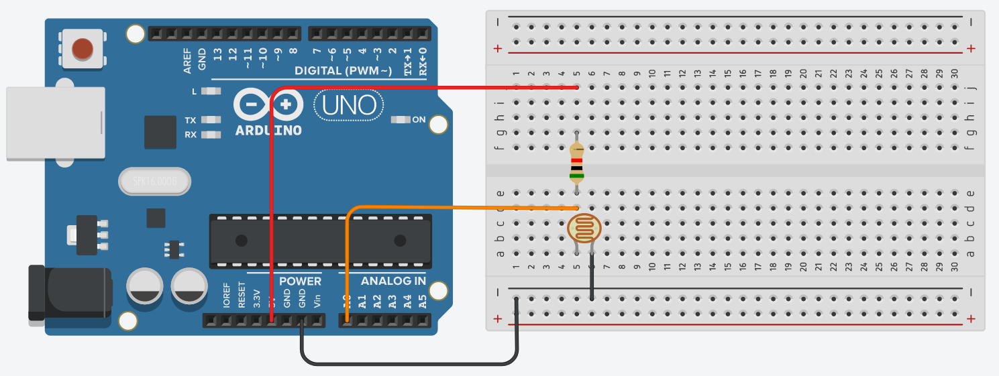
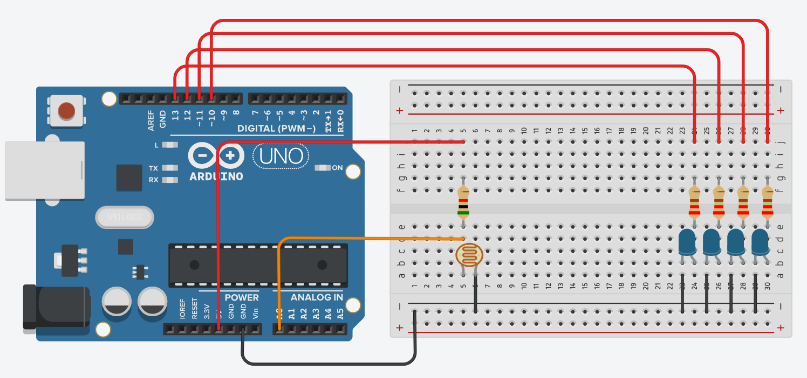
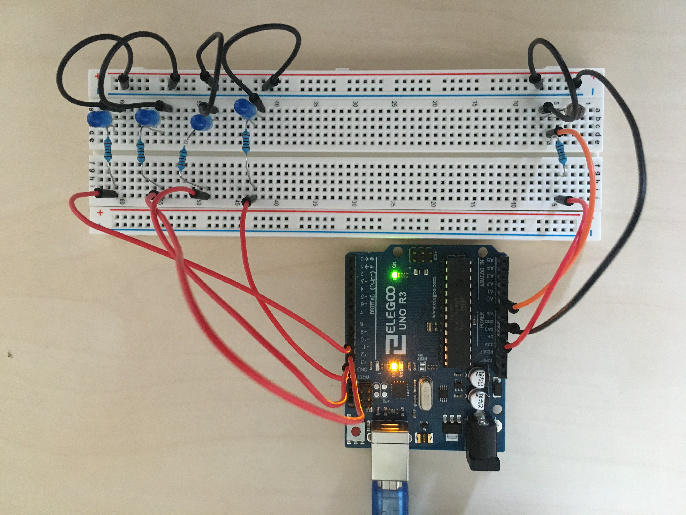

# Experiment 01: Photoresistor to Binary Decoder
*Experiment conducted 2021/02/23*

For my first experiment I took the [10-bit analog]>[is that the correct term?] output of a photoresistor (also known as a photocell), decoded the 4 most significant bits in code running on the Arduino, and then displayed those four bits on LEDs.


## [Components Used]>[Check that these are correct]

@standard-components
* 1 x Photoresistor
* 1 x 5KΩ resistor
* 4 x LEDs
* 4 x 220Ω resistors

## Step 1: Wiring The Photoresistor
I first wired the photoresistor as shown below, using the 5KΩ resistor.



A red wire takes a 5V voltage from the Arduino into the circuit. The voltage passes through the 5KΩ resistor, which then goes through the photoresistor. The black wires then carry the voltage through to the ground pin of the Arduino. The two resistors wired in this way creates a potential divider circuit. I've deliberately used two black wires to ground the singal, one connecting the potential divider to the negative rail, and one connected the negative rail to the Arduino, as this will let me ground the LEDs by connecting them to the negative rail later.

The resistance of the first resistor is static, however the resistance of the photoresistor changes depending on the light level. The more light, the [more/less]>[which is it?] resistance there is. This means the more light their is, the lower the signal from the potential divider there will be.

The orange wire is used to carry the signal from the potential divider into the Arduino. We connect to pin A0, as the analog pins are able to read the analog signal as a 10-bit number. This allows us to read an arbitrary unit numerical value, instead of just whether the signal is high or low like with digital pins.

## Step 2: Decoding The Signal in Code
By reading the signal carried by the orange wire, we can now read how much light the photocell is detecting. The more light, the smaller the signal will be.

We can program our `setup()` function to read this analog signal into the Arduino. In the meantime, we will also set up pins 10-13 as digital outputs, which we will use to output the 4 most significant bits of the signal to the LEDs.

```C
void setup() {
  pinMode(A0, INPUT); // Read in the 10-bit "analog" signal from pin A0
  pinMode(10, OUTPUT); // Setup pins 10-13 as output pins
  pinMode(11, OUTPUT);
  pinMode(12, OUTPUT);
  pinMode(13, OUTPUT);
  Serial.begin(9600); // Setup outputting to the serial output. For our purposes, "9600" is just a magic number
}
```

Next we will create a function that will take that signal as input, and output the value of a particular bit as a boolean. Here `x` is the value being decoded and `k` is which bit we are decoding (0-indexed). (Though it might be slightly erroneous to make this it's own function, it makes the loop code more readable, and the compiler will likely inline the function for us anyway.)

```C
bool decode(int x, int k) {
  return (x & ( 1 << k )) != 0;
}
```

We now have everything we need to create our loop function. Here we store the signal from the potential divider in variable `s`, output that value to the serial port, and then one by one decode each bit and update our digital outputs accordingly.

```C
void loop() {
  int s = analogRead(A0); // Read the singal on pin A0
  Serial.println(s); // Output that signal to the serial output
  digitalWrite(10, decode(s, 6) ? HIGH : LOW); // Decode the 7th bit
  digitalWrite(11, decode(s, 7) ? HIGH : LOW);
  digitalWrite(12, decode(s, 8) ? HIGH : LOW);
  digitalWrite(13, decode(s, 9) ? HIGH : LOW); // Decode the 10th bit
  delay(10);
}
```

@complete-code

## Step 3: Displaying The Decoded Signal
Now that our code is decoding and outputting the signal, we want to display that using our four LEDs. Each LED has it's own 220Ω resistor. They are wired the same, except that each connects to a different pin on the Arduino. As we want the left-most LED to display the most significant bit (the 10th bit), we will connect it to pin 13.



Depending on what colour and make LEDs you use, you may need to tweak what strength of the LED resistors to achieve the desired brightness

## There you have it!



This was a fun first experiment into working with electronic components, which went smoothly enough I'm a little suspicious. Though, I did have to experiment with using different strengths of resistor to achieve the desired results with the LEDs and potential divider. Through experimentation in TinkerCAD, I also came to realise the amount of light received by the photoresistor and the output of the potential divider were not linearly correlated. As the amount of light received when from bright to dark, the signal would first decrease slowly, then start decreasing faster and faster. For this experiment that wasn't a problem, but it did mean it was much easier to deliberately create binary numbers 0-3 than 4-7 using the LEDs. This could be resolved in code by converting the non-linear input of the potential divider into a linear one.
