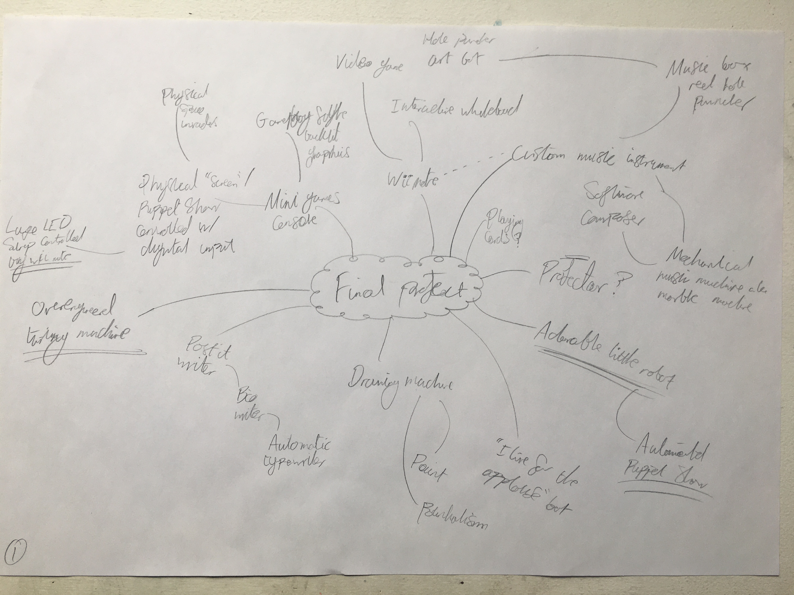
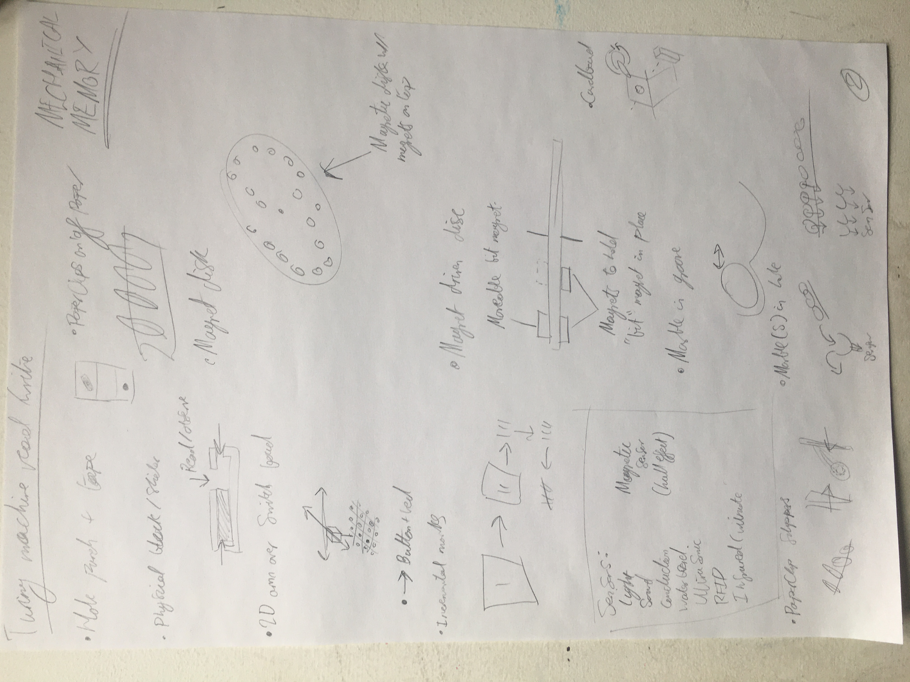
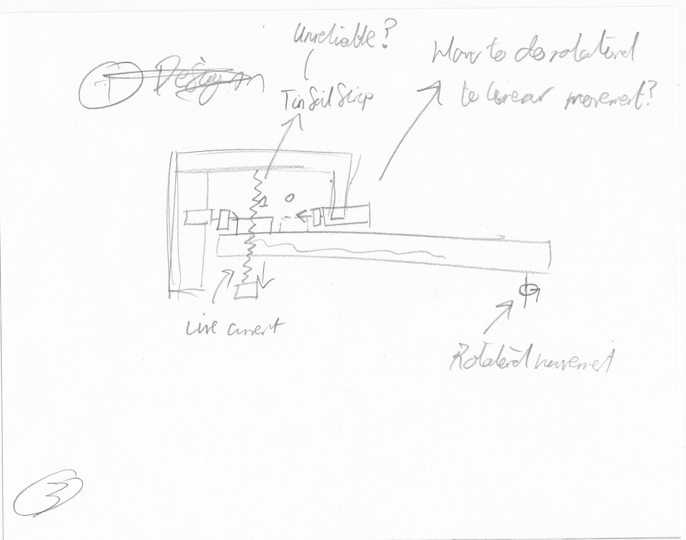
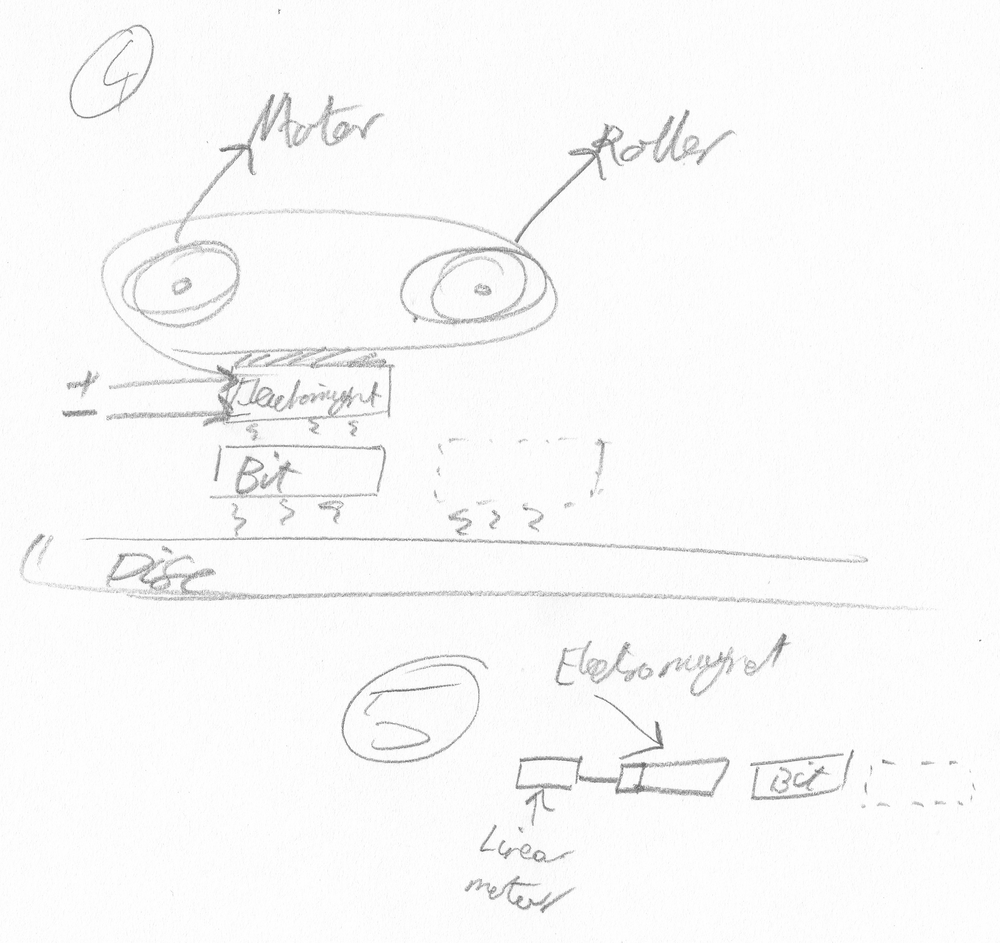

# Final Project #1 : Brainstorming

## The Idea
[Charles Babbage's mechanical computer](https://en.wikipedia.org/wiki/Charles_Babbage) and [Alan Turing's a-machine](https://en.wikipedia.org/wiki/Turing_machine) (better known as the Turing Machine) both live rent-free in my imagination, which leads to some esoteric ideas and trains of thought! For my project I want to create a primitive Turing Machine - where the machine itself is operated by the Arduino, which then reads and writes to a mechanical memory.

**Fig 1:** I did _try_ to have a more reasonable idea before jumping into working on an overengineered Turning Machine. But, this idea was easily the most captivating, both to me and to the people I showed it to. Though, I did also consider doing a project with my new favourite infrared camera, the Nintendo Wiimote.

Though I am confident I can program the machine, how the mechanical memory will work and how I will construct it are both full of unknowns. Therefore, the first thing I did was think through every component the machine will need, and brainstorm how each may work. Running experiments is the only true way to determine what will work and what won't, but I still wanted to take time to explore options on paper as to help inform my thinking later on in the process (and if I'm lucky eliminate some dud ideas early on).

## Brainstorming the Mechanical Memory
Modern computers use [Random Access Memory](https://en.wikipedia.org/wiki/Random-access_memory), which allows all the memory cells to be read from and written to at the same speed, regardless of it's physical position. In the spirit of the hypothetical machine Turning set out however, I want to construct a [Sequential Access Memory](https://en.wikipedia.org/wiki/Sequential_access_memory).

For this project, the memory needs to be able to do three things.
1. Move the memory cells. (as this will probably be easier than moving the read and write electronics to the desired memory cells)
2. Read the symbol at the current cell.
3. Write at least two symbols to the current cell.

**Fig 2:** A series of sketches of how the various read/write mechanisms of the machine could work.

### Moving Memory Cells
Creating a mechanical memory comes with a set of challenges. To be able to read and write to memory, it seems likely that each memory cell will have to have moving parts (making marks on the strip would be both difficult to read, and difficult to "undo" to make way for new marks). This could be a problem, as each moving part is a potential point of failure. Additionally, a long and potentially rigid strip, though possible, could be difficult to move around and/or to fit in a confined space.

The first problem I don't think can be fully eliminated, but I tackle in the next section. The second problem can be resolved by making the memory a loop, rather than a linear strip. In practise, this could be the circumference of a disk, or possibly a ring. A stepper motor will be ideal for rotating a disc around it's centre, making moving the memory cells precisely much easier. The only drawback of this is there will be wasted space in the middle of the disk, but that is more than acceptable for this project.

### Reading & Writing
As long as the memory can read and write at least two "symbols" to each memory cell, the machine will can be Turning complete. The hypothetical a-machine could write, erase, and detect arbitrary symbols to a strip of paper. The prospect of leaving the binary realm and having more than two symbols is exciting, however for practical purposes I will use two symbols. Specifically, the write head will move a physical object into one position or another, and the read head will detect the absence or presence of that object in one of the positions.

Looking at the approaches I brainstormed, it appears there is something of a trade-off between the complexity of a memory cell and the complexity of the read and write mechanisms. The less complex you make one, the more complex becomes the other.

However, there is a quite simple solution which I will experiment with first. In it, each memory cell is a folded piece of cardboard, held down by some thread, that is able to flip back and forth. Flip it one way, and that's your first symbol, flip it the other way, and that's your other symbol, henceforth, true and false. A motor can write to the memory cell by flipping it in the desired direction. A photo resistor can read the memory cell, by seeing if it blocking light to a particular location - which it will do when in the "true" position, and won't when it is in the "false" position.

# Experiments!
With a potential version of the machine mapped out, I now need to experiment with each component to see if it'll work as intended. My immediate next steps are to test:

1. If I can rotate the memory loop
2. The mechanics of the write motor
3. The mechanics of the read sensor
4. If all the parts work together
