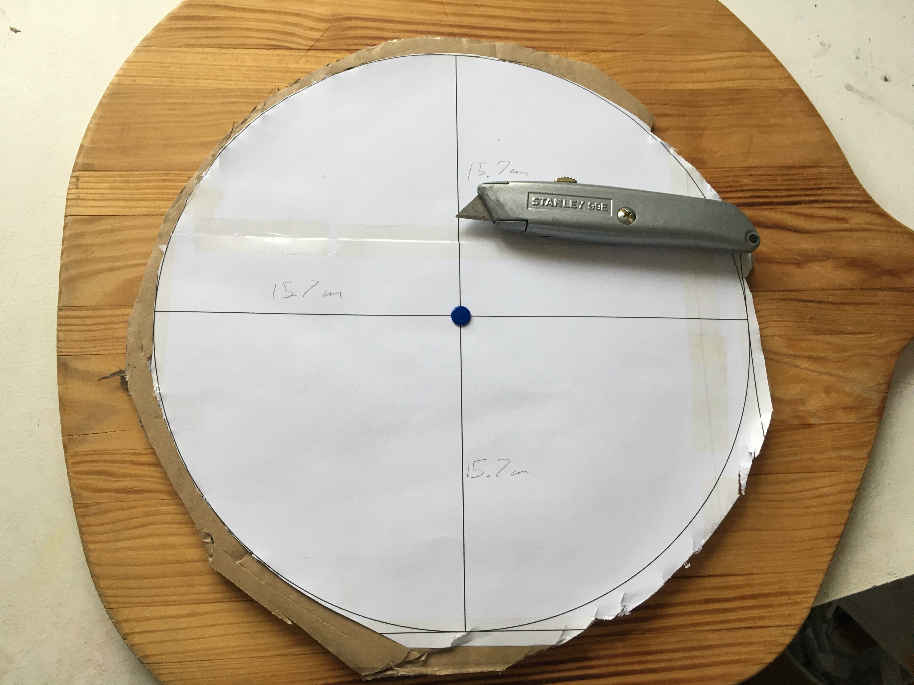
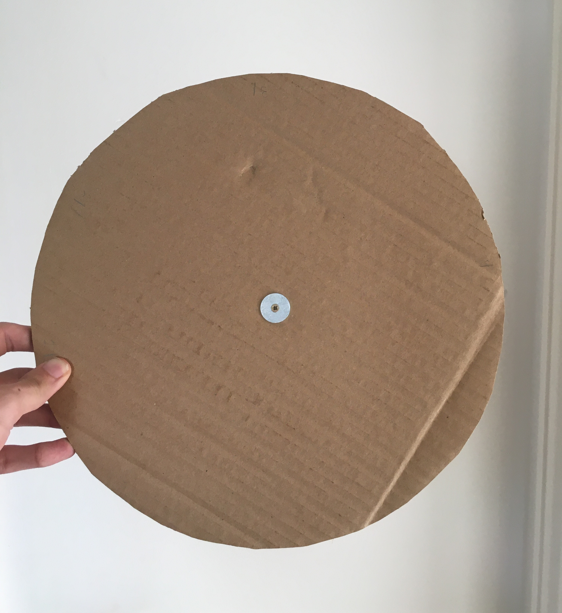
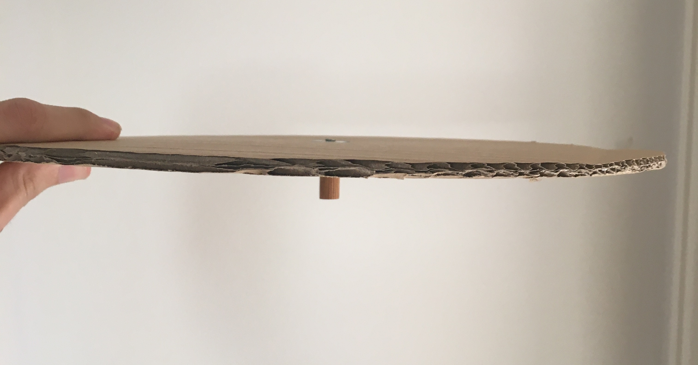

# Final Project #6 : Perils of the Disc Memory

Chronologically, this post takes place alongside the following posts, where I assemble the whole machine. However, creating a version of the disc memory that wasn't full of issues proved to be a saga in and of itself, so I separated it out into it's own post.

## From Disc One to Disc Three
Originally, I had intended to use the plastic lid from my original experiment (disc number one) on the final machine. However, the distorted shape and warble of that lid meant that the write motor wasn't consistently able to hit the top of each bit - as some bits ended up centimetres lower down than others. In response to this I decided to make a new lid, and also took the opportunity to make it bigger, in hopes of being able to fit more bits on it that way.

I made lid number two by drawing around the base of a bin onto a sheet cardboard. Though this disc turned out well, I struggled to pin point the centre of it, and ultimately missed.

Rather than continually trial and error for a suitable centre on disc two, I moved onto disc three. To make it, I considered pinning a piece of string to a decided centre and attaching a pencil to the other end, as a way of drawing a circle with a known centre. However, I realised I could remove human error if I instead printed a computer generated template, stuck that onto the cardboard, then cut around it.

I printed a template I made in PowerPoint onto four pieces of A4 (each with lots of overlap with it's neighbours), taped them to one another in their correct position, then taped the edges of the paper to the cardboard. I also put a pin through the centre of the template, which served both to mark the centre on the cardboard, and to hold the paper in place once I started cutting away the edges of the paper.

The scissors I used while cutting where able to cut the cardboard fine, however struggled cutting the cardboard and the paper at the same time. This caused the cardboard to fray and made it more difficult to cut. To resolve this, I used a Stanley knife to cut around the circumference of the template circle, allowing me to then cut away the remaining cardboard. As my kitchen chopping board wasn't particularly big, I did this on a pizza board to prevent damaging the desk with the Stanley knife.

## Attaching the Disc to the Stepper Motor
This disc initially worked really well. Using a single blade of a small pair of scissors, I was able to create a small hole that fit tightly onto the axle of the stepper motor. However, far quicker than I expected the movement of the stepper motor enlarged the hole and caused it to gradually loose it's grip. This soon meant that whenever the stepper motor stopped spinning, the momentum of the disc would cause it to overshoot, which it could do in either direction depending on whether the motor had been going clockwise or anti-clockwise. Though I kept the cardboard bits fairly large, this margin of error still made it difficult to consistently position the bits such that the write motor could hit them.

My solution to this was to attach a much more rigid piece of wood to the underside of the disc at it's centre, which then attaches to the stepper motor axle. To attach the disc to the wood, the disc is sandwiched between two metal washers with a screw through them that is drilled into the wood. I didn't have the tools to machine a hole in the bottom of the wood that could tight-fit onto the axle, so to attach the wood to the axle, I drilled out a hole in the wood and inserted a piece of plastic into it, which also has a hole drilled out. I was able to push the axle into the hole in the plastic, and the whole thing became a tight-fit.

This was successful for quite a while! However, after an amount of time it became more and more frequent that the axle would "slip" within the plastic, causing the motor to stutter and the disc to become out of sync.

## Alternative Attachments
I experimented with different replacements for plastic that could maintain a tight-fit without causing issues for the motor. This included blu-tack, cable insulation, and padding in the form of cut felt and blanket. I even tried ditching the piece of wood and replacing it with a [binder clip](https://en.wikipedia.org/wiki/Binder_clip). However, all of these solutions were prone to one or more of following:

* The amount of material was imbalanced on either side of the axle, causing the disc to slant.
* The momentum of the spinning disc was to strong for the material to be able to prevent the disc overshooting it's target
* Material getting caught in the gears inside the motor (I think may have occurred)
* The axle slipping inside the material, creating friction the motor couldn't handle and causing the disc to become out of sync.

In the final machine, I used a combination of cable insulation and cut blanket. This works very well when it does work, and has lasted longer than anything else I tried. However, it is still prone to the friction problem, and will at times cause the disc to become out of sync.

## Evaluation
While I do think that access to more precise tools would have elevated some of these problems, with hindsight I also think there are a couple underlying problems. The first is the weight of the disc. By making the disc bigger, and as a result of using a heavier kind of cardboard, the disc gains more momentum when spinning, which makes keeping it stable much trickier. The second problem is by attaching a length of wood to the disc the axle of the motor essentially becomes longer, making it harder to balance the disc and keep it flat.

Given another go at it, I think a solution based around gear attachments would work much better. The disc would be affixed onto it's own axle, and then driven by a stepper motor with a factory made gear attachment of the appropriate model. As well as making the machine more reliable, this would open up the opportunity to use gear ratios to have more fine grained control over how the stepper motor drives the disk.
