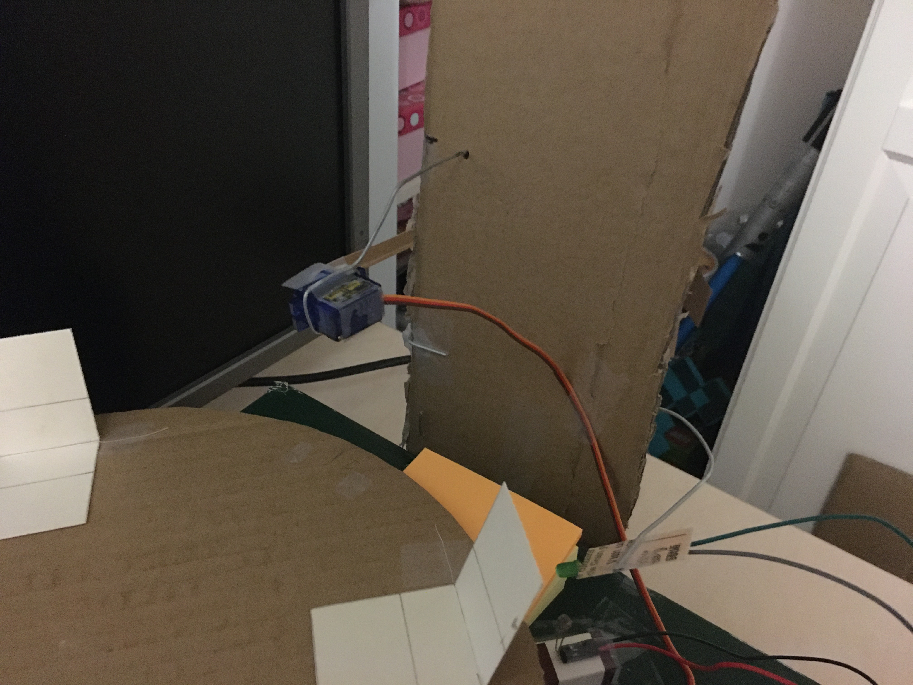
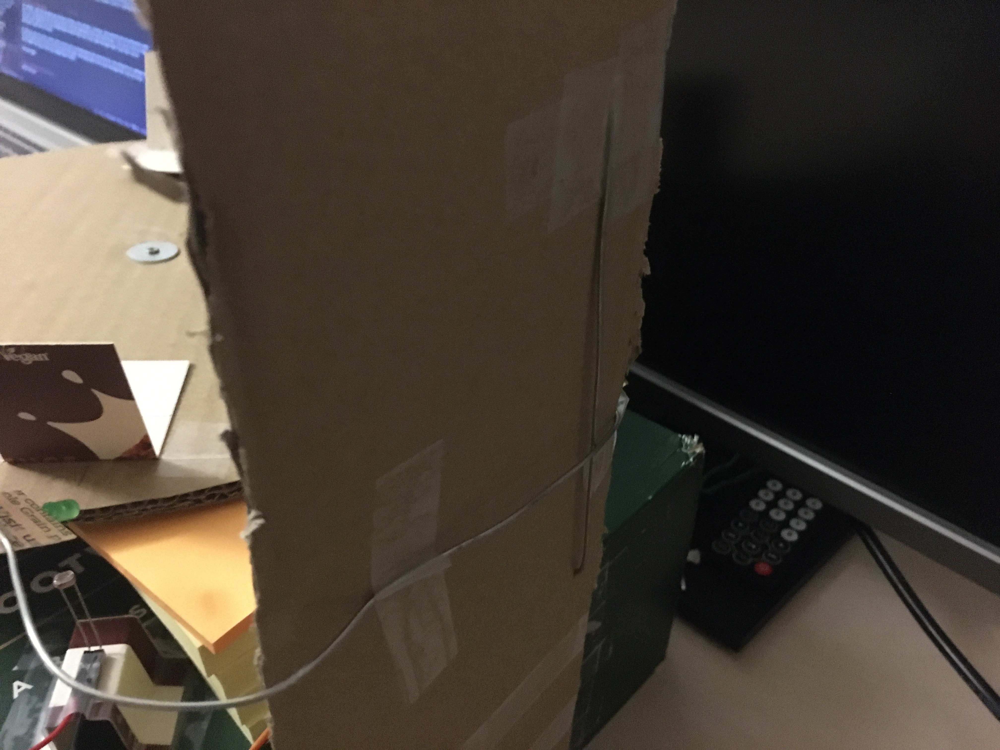
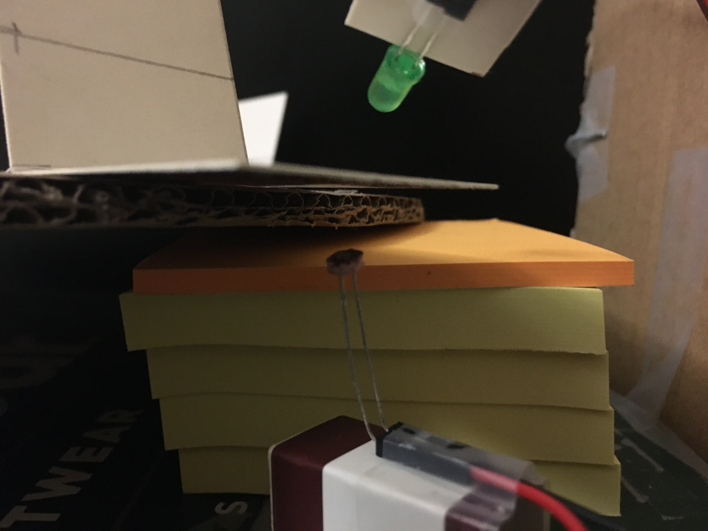

# Final Project #8 : Assembly of the Machine

The entire machine is built on a large cardboard box, which I did simply so I could easily move the machine as one unit. Each component is attached to the box by some combination of blu-tack, tape, carboard, and metal wire. Besides continual failure of the memory loop, there were only a few other challenges I faced while physically putting the machine together.

## Attaching the Write Motor
The write motor needs to be suspended above the memory disc in such a way that the area around the disc is left clear for memory bits to pass through without hitting anything. Initially I suspended the motor in the air with a single piece of wire, as shown in the video below.

?[youtube-video](gLwQKJ8Hqf4)

This worked reasonably well, and had the advantage that is was easy to adjust the position of the motor by bending the wire. However, because I had taped the wire to the side of box, it was able to rotate back and forth, meaning I couldn't move the cables connecting to the motor out of the way of the memory loop without also moving the motor. Without a better way to keep the wire stable, my solution was to attach another piece of cardboard to the box and drive the wire through it at two different points. This allowed the wire to stay in a fixed position, while still being moved about. I could have drove the wire into the box itself, but by using a separate piece of cardboard instead I could ensure I wouldn't make holes in the box that might cause problems for future me.

## Protecting the Photoresistor
The challenges I faced with the memory disc had knock on effects on the read head. In testing, I had discovered that the photoresistor worked better if it was positioned as close as possible to where a flipped cardboard bit would land when blocking it. However, when the disc warbled, this would cause flipped bits to strike the photoresistor from the side. This in turn caused the stepper motor to get stuck, and the photoresistor to get bent out of place.

My solution to this was to place a stack of post-it notes next to the photoresistor that prevent the disc from leaning too low. Sometimes this will create enough friction on the disk to prevent the stepper motor from turning, which in turn causes the memory disc to go out of sync. Overall though, this solution solves more problems then it creates.

## Inconsistent Ability to Write to Bits
During my [initial test](https://physicalcomputingwithj.tumblr.com/post/652205041959174144) of how well I could write to the cardboard bits, I left the motor running for a while to see if eventually the bit would stop working. In that experiment it kept going, and seemed to hold up really well. However, in that test the bit was sat on a rigid, flat, surface. Now that the bit was on a wobbly disk, problems consistently being able to write to the bit became quite frequent.

My solution to this was to every time the machine attempts to write to a bit, have the machine then re-read the bit to test if writing was successful. While it is very much a hack, it works quite well on the final machine.
